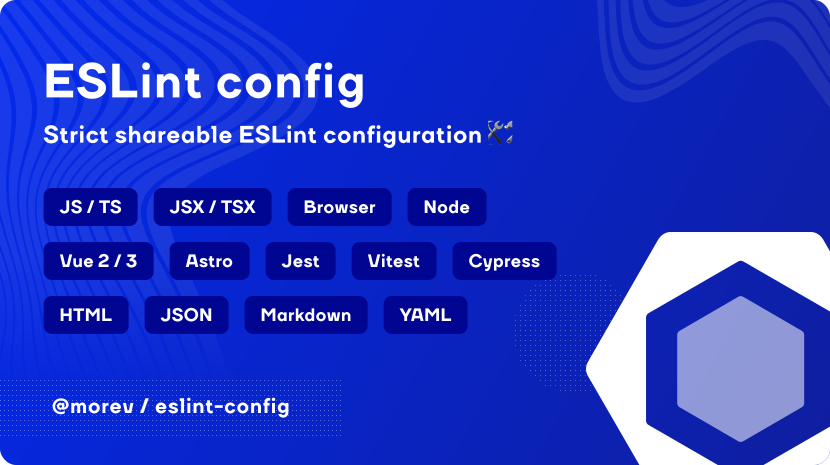

[](https://opensource.org/licenses/MIT)


# @morev/eslint-config

Strict shareable ESLint configuration with reasonable defaults.

## Table of contents

* [Installation](#installation)
  * [Automatic installation via CLI](#automatic-installation-via-cli)
  * [Manual installation](#manual-installation)
    * [Adding the required packages](#adding-the-required-packages)
    * [Creating the configuration file](#creating-the-configuration-file)
    * [Creating `npm scripts` for linting](#creating-npm-scripts-for-linting)
    * [Configuring VSCode](#configuring-vscode)
      * [Disabling `prettier`](#disabling-prettier)
      * [Enabling autofix on save](#enabling-autofix-on-save)
      * [Enabling ESLint to work with any supported file format](#enabling-eslint-to-work-with-any-supported-file-format)
      * [Suppressing stylistic errors noise](#suppressing-stylistic-errors-noise)
* [Package contents](#package-contents)
  * [`combine` utility function](#combine-utility-function)
  * [`defineIgnores` utility function](#defineignores-utility-function)
  * [`defineConfiguration` function](#defineconfiguration-function)
  * [Extra useful exports](#extra-useful-exports)

## Installation

You have two options:

* Automatic installation/configuration via CLI using the installation wizard *(recommended)*;
* Manual installation and configuration.

Both options are described below.

### Automatic installation via CLI

Just run the package binary using your favorite package manager:

```bash
# Using `npm`
npx @morev/eslint-config@latest

# Using `yarn`
yarn dlx @morev/eslint-config@latest

# Using `pnpm`
pnpm dlx @morev/eslint-config@latest

# Using `bun`
bunx @morev/eslint-config@latest
```

Then follow the installer instructions.

> [!IMPORTANT]
> For your first installation, it is recommended to check all the boxes on the first step -
> at each substep you will see messages explaining what will be done (and why),
> and be asked whether or not to continue. \
> It's safe - every potentially dangerous move will require explicit confirmation.

> [!NOTE]
> You can run the wizard anytime, even after manual installation or partial setup - just run the command above.

---

### Manual installation

> [!TIP]
> This section also explains everything that happens during automatic installation when using the CLI. \
> The setup wizard is simply a way to automate all of these steps.

#### Adding the required packages

Add the `eslint` and `@morev/eslint-config` packages as `devDependencies` using your favorite package manager:

```bash
# Using `npm`
npm install -D eslint @morev/eslint-config

# Using `yarn`
yarn add eslint @morev/eslint-config --dev

# Using `pnpm`
pnpm add -D eslint @morev/eslint-config

# Using `bun`
bun install -D eslint @morev/eslint-config
```

> [!TIP]
> You will also need the `typescript` package installed if you are using the `typescript` configuration.

> [!CAUTION]
> Minimum environment requirements:
>
> * Node 20 or higher.
> * `eslint^9.9.1`;
> * `typescript^5.4.2` (if used);

#### Creating the configuration file

Create the [`eslint.config.js`](https://eslint.org/docs/latest/use/configure/configuration-files) file
with the following content as a starting point:

```js
import { combine, defineConfiguration, defineIgnores } from '@morev/eslint-config';

export default combine([
  defineIgnores(),
  defineConfiguration('javascript'),
  // ...define other configurations, if necessary,
  // using the `defineConfiguration` function or
  // using ESLint-compatible format of configuration.
]);

```

For more explanations on this part, take a look at [Package contents](#package-contents) section.

---

#### Creating `npm scripts` for linting

It's a good practice to have `npm script`s that will start the linting process. \
You can run them when committing with git hooks or during the validation in CI, etc.

Open your `package.json` and create these scripts for linting within "scripts" section:

```json
{
  "scripts": {
    "lint:eslint": "eslint .",
    "lint:eslint:fix": "eslint . --fix",
  }
}
```

> [!NOTE]
> You don't have to use those exact names - this is just an example,
> implying that there are other linters (stylelint, ls-lint, etc) as well.

<details>
  <summary>❓ What if I only need to validate files in a certain directory?</summary>

  ---

  You have two ways: disable ESLint for non-linting files using [`defineIgnores`](#defineignores-utility-function) (recommended),
  or call ESLint only for required files in `npm scripts`.

  **Method 1 (recommended): Excluding files**

  It is usually easier to identify files/directories **NOT** intended for linting
  and disallow their linting at the config level:

  ```ts
  // 📄 eslint.config.js

  export default combine([
    defineIgnores({
      extraIgnoredFiles: [
        '**/backend/**', // Do not lint the files within `backend` directory
      ],
    }),
  ]);
  ```

  This allows `eslint` to be called without arguments at the global level
  and ensures that even IDE extensions will not apply linting rules to these files.

  **Method 2: Run only for necessary files**

  ESLint takes paths for files to be checked as an argument. \
  By default it runs for all files, but you can limit this list:

  ```jsonc
  {
    // Only run ESLint for files within "frontend" and "open-api" directories
    "lint:eslint": "eslint \"./{frontend,open-api}/**\""
  }
  ```

  > It is important to use quotes for Windows compatibility.

  Keep in mind that in this case you lose the possibility to call ESLint without arguments (and expect a correct result)
  also there is nothing to prevent the IDE's extension from automatically making changes to these files once you open and save them.

</details>

---

#### Configuring VSCode

For a better user experience, install the [official ESLint extension](https://marketplace.visualstudio.com/items?itemName=dbaeumer.vscode-eslint).

Next, create the `.vscode/settings.json` file in the project root (if not exists). \
This file contains settings that apply only to a specific project, so your other projects will remain in the same state
(you can read more about its behavior [here](https://code.visualstudio.com/docs/getstarted/settings#_workspace-settings)).

If the file already exists, you will need to add/replace/merge the necessary keys/values yourself.

> [!TIP]
> The format of `.vscode/settings.json` file is actually `JSONC` - so you can safely use comments and trailing commas inside.

##### Disabling `prettier`

Prettier is a popular (unfortunately) solution used by many people. \
This config is designed to be used **INSTEAD** of `prettier`, providing mostly the same,
but less restrictive and opinionated code formatting options. \
And, thanks to ESLint's ideals, you can rewrite or even disable individual rules that don't suit you,
while leaving the rest unchanged.

Put these lines in the `.vscode/settings.json` file:

```jsonc
{
  // ESLint handles formatting.
  "prettier.enable": false,
}
```

##### Enabling autofix on save

One of the reasons for the popularity of `prettier` is that it works and makes changes immediately. \
Fortunately, all stylistic rules (and many others!) can automatically fix the code,
and do so seamlessly when the file is saved.

Put these lines in the `.vscode/settings.json` file to enable this feature:

```jsonc
{
  // Turn autofix on.
  "editor.codeActionsOnSave": {
    "source.fixAll.eslint": "explicit"
  },
}
```

##### Enabling ESLint to work with any supported file format

By default, [VSCode ESLint extension](https://marketplace.visualstudio.com/items?itemName=dbaeumer.vscode-eslint)
only validates JavaScript files, but the config provides a configurations to work with JSX, Astro, Vue, YAML, JSON files and so on.

All available configurations are listed in the [`defineconfiguration`](#defineconfiguration-function) section.

Put these lines in the `.vscode/settings.json` file
to enforce the extension to check all files supported by this package:

```jsonc
{
  // Enable ESLint for all files that could
  // potentially be processed by ESLint.
  "eslint.validate": [
    "javascript",
    "javascriptreact",
    "typescript",
    "typescriptreact",
    "vue",
    "astro",
    "html",
    "markdown",
    "json",
    "json5",
    "jsonc",
    "yaml"
  ],
}
```

##### Suppressing stylistic errors noise

Some stylistic rules have an "error" severity, but each stylistic error can be automatically fixed when saving.

However, do you need constant red underlines while typing the code for a rule that can be fixed automatically? \
I believe not. \
It gets even worse if you are using something like
[Error Lens VSCode extension](https://marketplace.visualstudio.com/items?itemName=usernamehw.errorlens).

Fortunately, there is a way to modify the severity of rules for the IDE only,
leaving the values in the config itself unchanged (e.g., to run via CLI).

Put these lines in the `.vscode/settings.json` file to set the severity of such rules as "warning":

```jsonc
{
  // Suppress stylistic errors, but still autofix them.
  "eslint.rules.customizations": [
    { "rule": "@stylistic/*", "severity": "warn", "fixable": true },
    { "rule": "*-indent", "severity": "warn", "fixable": true },
    { "rule": "*-spacing", "severity": "warn", "fixable": true },
    { "rule": "*-spaces", "severity": "warn", "fixable": true },
    { "rule": "*-order", "severity": "warn", "fixable": true },
    { "rule": "*-dangle", "severity": "warn", "fixable": true },
    { "rule": "*-newline", "severity": "warn", "fixable": true },
    { "rule": "*quotes", "severity": "warn", "fixable": true },
    { "rule": "*semi", "severity": "warn", "fixable": true }
  ],
}
```

> [!TIP]
> You can even turn the IDE highlighting off for such rules using `off` instead of `warn`, but I wouldn't recommend it.
>
> Using this approach, errors are still highlighted, but not as "loudly". \
> Thus, every developer can clearly see which codestyle is considered good,
> but at the same time not overloaded with a lot of "red underlines".

---

## Package contents

The main export of the package provides 3 functions - `combine`, `defineIgnores` and `defineConfiguration`. \
All of these functions are inline-documented using JSDoc with the provided TS types, so you'll always have hints right in the editor. \
However, let's look at them in more detail:

### `combine` utility function

Your [`eslint.config.js`](https://eslint.org/docs/latest/use/configure/configuration-files) file
should export the configurations (both imported from this package and, optionally, other parts)
wrapped with the `combine` utility:

```js
// ❌ won't work
export default [
  defineIgnores(),
  defineConfiguration('javascript'),
  // ...other configuration parts
];

// ✅ will work
export default combine([
  defineIgnores(),
  defineConfiguration('javascript'),
  // ...other configuration parts
]);
```

For future extensibility, many configurations are designed as an array of configuration objects,
whereas ESLint expects a flat list of configurations.

All the `combine` function does is flatten the array:

```js
export const combine = (...configurations) => {
  return configurations.flat(Infinity);
};
```

> [!NOTE]
> You can safely add other parts of the configuration
> (not provided by this package) inside the `combine` function as well:
>
> ```js
> import eslintPluginFoo from 'eslint-plugin-foo';
>
> export default combine([
>   defineIgnores(),
>   defineConfiguration('javascript'),
>   {
>     plugins: {
>       foo: eslintPluginFoo,
>     },
>     rules: {
>       'foo/rule': 'warn',
>     },
>   },
> ]);
>
> ```

---

### `defineIgnores` utility function

`defineIgnores` function does not provide any rules, but configures files that should **not** be processed by ESLint. \
It automatically reads the root `.gitignore` file to inherit ignored paths,
and adds some known non-linting files to reduce the config verbosity.

> [!TIP]
> You can see these extra patterns for ignoring in the source code (the `GLOB_EXCLUDE` constant) [here](./src/globs.ts).

Under the hood, it uses [`eslint-config-flat-gitignore`](https://github.com/antfu/eslint-config-flat-gitignore) package.

> [!IMPORTANT]
> The function only considers the root `.gitignore`. \
> If the project has child directories containing its own `.gitignore`,
> they will not be read and must be added manually using the `extraIgnoredFiles` or `gitignoreFiles` setting.

<details>
  <summary>❓ How to add custom files to the ignore list?</summary>

  ---

  Just pass a [minimatch](https://github.com/isaacs/minimatch)-compatible array of strings
  as `extraIgnoredFiles` argument.

  > You can use <https://globster.xyz/> website to check such strings.

  Some examples:

  ```ts
  // 📄 eslint.config.js

  export default combine([
    defineIgnores({
      extraIgnoredFiles: [
        'foo.txt',        // Single file (relative to the root directory)
        'foo/**',         // All files inside the directory
        '**/bar/**',      // All files inside any directory named "bar"
        '**/baz/**/*.js', // Only JS files within any directory named "baz"
      ],
    }),
  ]);
  ```

  ---

</details>

<details>
  <summary>❓ How to account for other `.gitignore` files? Or if my `.gitignore` is not in the root?</summary>

  ---

  Simply pass the paths to the required files as the `gitignoreFiles` argument.

  **❗IMPORTANT❗** \
  If you use this option, you MUST include the root `.gitignore` in the array as well.

  ```ts
  // 📄 eslint.config.js

  export default combine([
    defineIgnores({
      gitignoreFiles: [
        '.gitignore', // The root `.gitignore` MUST be in the list if you are using `gitignoreFiles` option
        './src/assets/svg-sprites/_dist/.gitignore', // Additional `.gitignore` file to consider
      ],
    }),
  ]);
  ```

  `gitignoreFiles` value is passed to the [`eslint-config-flat-gitignore`](https://github.com/antfu/eslint-config-flat-gitignore)
  as the `files` argument without any changes.

</details>

---

### `defineConfiguration` function

This is the main function that enables ESLint rules for the selected environment.

**To enable a configuration**, pass its name as the first argument and (optionally) options as the second argument. \
The configurations are designed to work in most scenarios even without specifying options,
but if you need more detailed customization - you can do that:

```js
// 🗎 eslint.config.js

export default combine([
  defineIgnores(),
  defineConfiguration('vue', {
    version: 2,
    typescript: true,
  }),
]);
```

> [!NOTE]
> All configurations have options that are documented inline with TypeScript and JSDoc -
> so you'll have a short documentation right in the editor.

Each configuration has at least two options, `files` and `ignores`, which work just like these options in ESLint. \
All configurations are set up by default so that `files` corresponds to the appropriate files -
so the "vue" configuration has a preset `["**/*.vue"]`, and so on.

Let's take a more detailed look:

#### The configurations list:

* 🗂️ `javascript` - the base ESLint configuration with plugins related to `js` files.
  <details>
    <summary>Show the details</summary>

    ---

    The most basic and largest configuration is it's universal rules for JS code. \
    It is assumed that it **will always be enabled**.

    There's no fine-grain control here - it just includes rules that are universal to any JS code in any environment.

    ---

  </details>

* 📁 `browser` - additional JS rules related only to code that executes in the browser.
  <details>
    <summary>Show the details</summary>

    ---

    This configuration provides rules specific to the DOM API and also
    declares global variables that are only available in the browser context.

    By default, rules are enabled for all files (since there is no way to universally and unambiguously determine
    whether a file belongs to a browser context).

    If your project structure identifies files that refer **only** to the browser,
    it is recommended to set `files` explicitly (so that, for example, you get errors when you try to use `window` inside a server file).

    ```js
    export default combine([
      defineConfiguration('browser', {
        files: ['./src/client/**'],
      }),
    ]);
    ```

    ---

  </details>

* 📁 `node` - set of the rules for the code that use [Node.js](https://nodejs.org/) APIs.
  <details>
    <summary>Show the details</summary>

    ---

    This configuration provides rules specific to Node.js code and also
    declares global variables that are only available in the Node context.

    By default, rules are enabled for all files (since there is no way to universally and unambiguously determine
    whether a file belongs to a Node context).

    If your project structure identifies files that refer **only** to the Node,
    it is recommended to set `files` explicitly (so that, for example,
    you get errors when you try to use `process` inside a browser-related file).

    ```js
    export default combine([
      defineConfiguration('node', {
        files: ['./src/server/**'],
      }),
    ]);
    ```

    ---

  </details>

* 📁 `typescript` - for projects that use [Typescript](https://www.typescriptlang.org/).
  <details>
    <summary>Show the details</summary>

    ---

    This configuration provides rules specific to TypeScript and enables the TypeScript parser for TS(X) files.

    Just one important detail here - if you use TypeScript inside files that have a different extension (like `.vue` or `.astro`) -
    don't forget to specify those extensions as the `extraFileExtensions` option.

    Example of ESLint config for Vue 3 with TypeScript:

    ```js
    export default combine([
      defineConfiguration('vue', {
        version: 3,
        typescript: true,
      }),
      defineConfiguration('typescript', {
        extraFileExtensions: ['vue'],
      }),
    ]);
    ```

    ---

  </details>

* 📁 `jsx` - for projects that use JSX/TSX.
  <details>
    <summary>Show the details</summary>

    ---

    This configuration enables JSX a11y rules for JSX/TSX files
    as well as stylistic rules that belongs to JSX syntax.

    ```js
    export default combine([
      defineConfiguration('jsx'),
    ]);
    ```

    ---

  </details>

* 📁 `vue` - for projects that use [VueJS](https://vuejs.org/) (both `2` and `3`).
  <details>
    <summary>Show the details</summary>

    ---

    This configuration provides rules specific to Vue, enables the Vue parser for these files.

    The configuration can work with Vue2 and Vue3 both.

    By default, it tries to determine the Vue version in use,
    but you can set the version explicitly with `version` option. \
    If the version could not be determined, Vue3 rules are applied.

    By default, it enables TypeScript parser for Vue files. \
    If you don't use TypeScript, disable this behavior explicitly with the `typescript: false` option.

    > If you are using TypeScript, do not forget to put `extraFileExtensions: ['vue']` setting
    > in the `typescript` configuration options.

    Example of explicit setup for Vue 3 with TypeScript enabled:

    ```js
    export default combine([
      defineConfiguration('vue', {
        version: 3,
        typescript: true,
      }),
      defineConfiguration('typescript', {
        extraFileExtensions: ['vue'],
      }),
    ]);
    ```

    ---

  </details>

* 📁 `astro` - for projects that use [Astro](https://astro.build/) framework.
  <details>
    <summary>Show the details</summary>

    ---

    This configuration provides rules specific to Astro and enables the Astro parser for these files.
    It uses TypeScript parser under the hood which also works with pure JS.

    > If you are using TypeScript, do not forget to put `extraFileExtensions: ['vue']` setting
    > in the `typescript` configuration options.

    Example of explicit setup for Astro with TypeScript:

    ```js
    export default combine([
      defineConfiguration('astro'),
      defineConfiguration('typescript', {
        extraFileExtensions: ['astro'],
      }),
    ]);
    ```

    ---

  </details>

* 📁 `vitest` - for projects that use [Vitest](https://vitest.dev/) as a test platform.
  <details>
    <summary>Show the details</summary>

    ---

    This configuration enables Vitest-specific rules.

    By default, the rules apply to popular test file names, which in turn are driven by the tool's defaults. \
    By default, the configuration ignores Cypress default test filename pattern.

    > You can see these globs in the source code [here](./src/globs.ts) (`GLOB_TESTS` and `GLOB_CYPRESS` constants).

    It also declares `vitest` testing functions as
    [ESLint globals](https://eslint.org/docs/latest/use/configure/language-options#using-configuration-files) by default. \
    You can turn this behavior off by using `globals: false` option.

    If you have non-standard test file name pattern or a custom ignores,
    then specify files and exceptions explicitly using the `files` and `ignores` options.

    Example of `vitest` configuration in use:

    ```js
    export default combine([
      defineConfiguration('vitest'),
    ]);
    ```

    ---

  </details>

* 📁 `jest` - for projects that use [Jest](https://jestjs.io/) as a test platform.
  <details>
    <summary>Show the details</summary>

    ---

    This configuration enables Jest-specific rules.

    By default, the rules apply to popular test file names, which in turn are driven by the tool's defaults.
    By default, the configuration ignores Cypress default test filename pattern.

    > You can see these globs in the source code [here](./src/globs.ts) (`GLOB_TESTS` and `GLOB_CYPRESS` constants).

    If you have non-standard test file name pattern or a custom ignores,
    then specify files and exceptions explicitly using the `files` and `ignores` options.

    Example of `jest` configuration in use:

    ```js
    export default combine([
      defineConfiguration('jest'),
    ]);
    ```

    ---

  </details>

* 📁 `cypress` - for projects that use [Cypress](https://www.cypress.io/) as a test platform.
  <details>
    <summary>Show the details</summary>

    ---

    This configuration enables Cypress-specific rules.

    By default, the rules apply to the test file names that Cypress uses by default.

    > You can see these globs in the source code [here](./src/globs.ts) (`GLOB_CYPRESS` constant).

    If you have non-standard test file name pattern, then specify files explicitly using the `files` option.

    Example of `cypress` configuration in use:

    ```js
    export default combine([
      defineConfiguration('cypress'),
    ]);
    ```

    ---

  </details>

* 📁 `json` - for projects that use JSON, JSON5 and JSONC files.
  <details>
    <summary>Show the details</summary>

    ---

    This configuration enables rules that are specific to JSON(5|C) files,
    and also provides universal sorting of `package.json`.

    > You can see what exactly the rules apply to [here](./src/configurations/json/index.ts).

    Example of `json` configuration in use:

    ```js
    export default combine([
      defineConfiguration('json'),
    ]);
    ```

    ---

  </details>

* 📁 `markdown` - for projects that use [Markdown](https://en.wikipedia.org/wiki/Markdown) files.
  <details>
    <summary>Show the details</summary>

    ---

    This configuration attaches [`markdownlint`](https://github.com/DavidAnson/markdownlint)
    as a linter and formatter for `.md` files, using an adapter
    as the [`eslint-plugin-markdownlint`](https://gitlab.com/pawelbbdrozd/eslint-plugin-markdownlint/) package.

    Example of `markdown` configuration in use:

    ```js
    export default combine([
      defineConfiguration('markdown'),
    ]);
    ```

    ---

  </details>

* 📁 `html` - for projects that use pure HTML files.
  <details>
    <summary>Show the details</summary>

    ---

    This configuration enables HTML-specific rules and also includes formatting rules.

    Example of `html` configuration in use:

    ```js
    export default combine([
      defineConfiguration('html'),
    ]);
    ```

    ---

  </details>

* 📁 `yaml` - for projects that use [YAML files](https://en.wikipedia.org/wiki/YAML).
  <details>
    <summary>Show the details</summary>

    ---

    This configuration enables YAML-specific rules and also includes formatting rules.

    Example of `yaml` configuration in use:

    ```js
    export default combine([
      defineConfiguration('yaml'),
    ]);
    ```

    ---

  </details>

### Extra useful exports

If for some reason you need to access the plugins or parsers used within the package,
you can use the `/parsers` and `/plugins` exports:

```ts
import { parserTypescript } from '@morev/eslint-config/parsers';
import { pluginTypescript } from '@morev/eslint-config/plugins';
```

If you need to access the globs used within the package, you can use `/globs` export:

```ts
import { GLOB_TSX } from '@morev/eslint-config/globs';
```
